# VulnForge Architecture

VulnForge is an intentionally vulnerable, **security-less web application** built as an isolated cybersecurity training laboratory.

The goal is to make the application behave like a real-world web application while intentionally removing or weakening security controls so learners can practice:

- Reconnaissance
- Enumeration
- Request manipulation
- Authentication attacks
- Authorization testing
- SQL Injection
- XSS
- CSRF
- SSRF
- File upload attacks
- BOLA / IDOR
- JWT weaknesses
- API security testing
- Business logic attacks
- Misconfiguration discovery
- Attack chaining
- Exploitation and impact analysis


---

# 1. High-Level Architecture

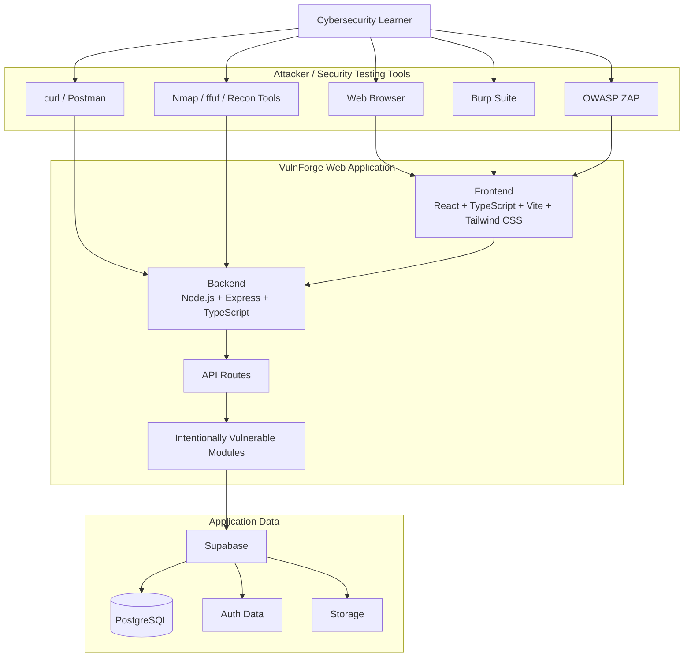

---

# 2. Core Philosophy — "0 Security" Lab

VulnForge intentionally simulates an application with weak or missing security controls.

```text
Normal Secure Application
        │
        ├── Strong Authentication
        ├── Strong Authorization
        ├── Input Validation
        ├── Output Encoding
        ├── CSRF Protection
        ├── Secure File Upload
        ├── Rate Limiting
        ├── Secure Headers
        ├── Parameterized Queries
        └── Access Control
                  │
                  ▼
            VulnForge Lab
                  │
                  ├── Weak / Missing Controls
                  ├── Vulnerable Endpoints
                  ├── Manipulatable Requests
                  ├── Predictable IDs
                  ├── Unsafe Input Handling
                  └── Intentionally Bad Logic
```

The purpose is not to build a secure production application first. The purpose is to provide a realistic **attack surface** where security testing can be learned safely.

---

# 3. Real Web Request Workflow

This is how a request actually moves through the application.

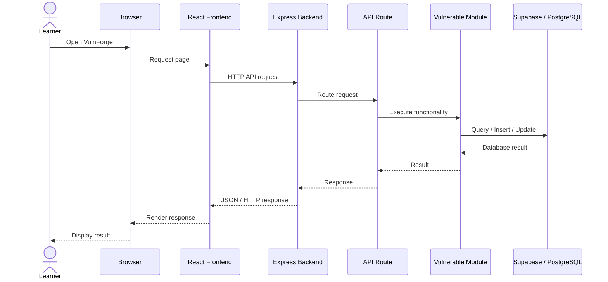

The learner can place Burp Suite or OWASP ZAP between the browser and application:

```text
Browser
   │
   ▼
Burp Suite / OWASP ZAP
   │
   │ Modified HTTP Request
   ▼
VulnForge
   │
   ▼
Backend
   │
   ▼
Vulnerable Module
   │
   ▼
Database
```

---

# 4. Application Architecture

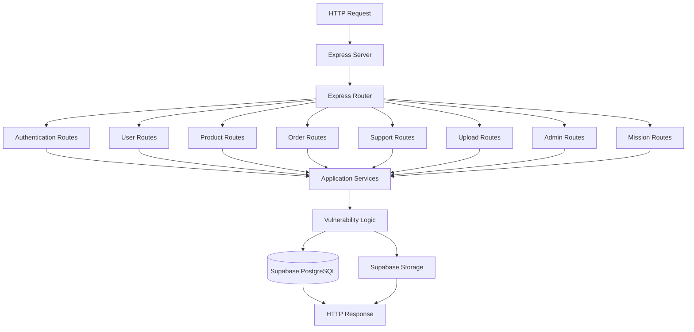

---

# 5. Frontend Architecture

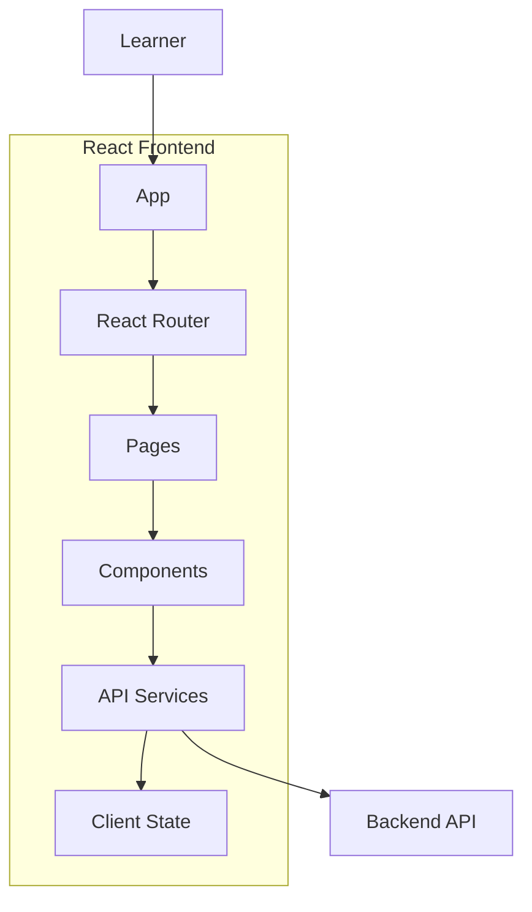

Main pages:

```text
Login
Register
Dashboard
Products
Product Details
Orders
Order Details
Profile
Support
Upload
Missions
Admin Lab
```

The frontend is **not a security boundary**.

Anything sent by the browser can be modified by the learner using Burp Suite, browser developer tools, curl, or another HTTP client.

---

# 6. Backend Architecture

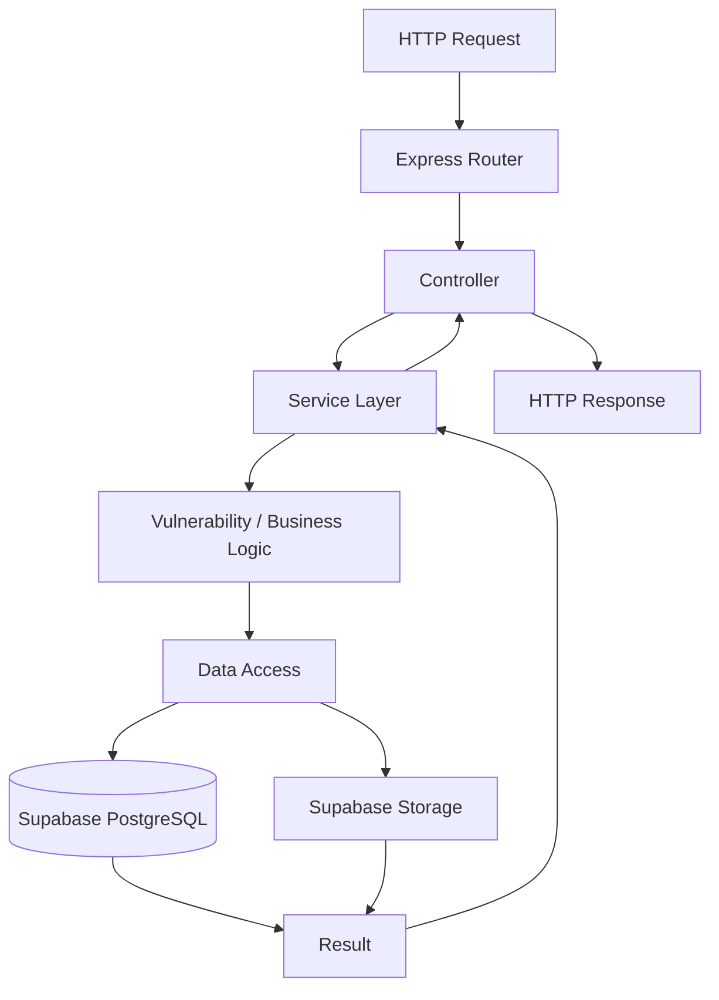

Recommended backend structure:

```text
backend/
└── src/
    ├── server.ts
    ├── app.ts
    ├── config/
    ├── routes/
    ├── controllers/
    ├── services/
    ├── modules/
    ├── database/
    └── utils/
```

---

# 7. API Attack Surface

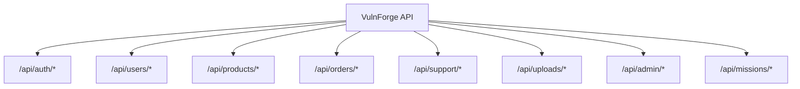

Example endpoints:

```text
GET     /api/products
GET     /api/products/:id

GET     /api/orders
GET     /api/orders/:id
POST    /api/orders
PATCH   /api/orders/:id
DELETE  /api/orders/:id

GET     /api/users/:id
PATCH   /api/users/:id

GET     /api/support/tickets
POST    /api/support/tickets
GET     /api/support/tickets/:id

POST    /api/uploads
GET     /api/uploads/:id

GET     /api/admin
GET     /api/admin/users
GET     /api/admin/orders

GET     /api/missions
POST    /api/missions/:id/attempt
```

These endpoints become the learner's primary attack surface.

---

# 8. Vulnerability Architecture

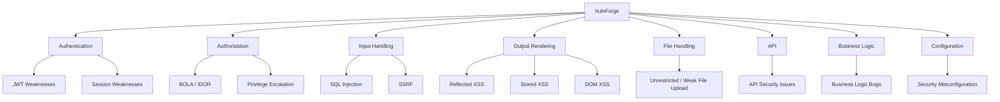

---

# 9. SQL Injection Workflow

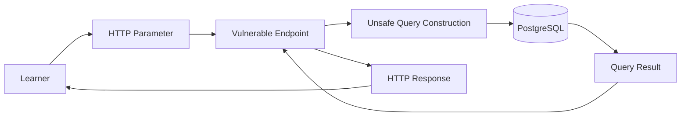

Training objective:

```text
Find Input
   ↓
Identify Injection Point
   ↓
Understand Query Behavior
   ↓
Demonstrate Controlled Impact
   ↓
Capture Evidence
```

All database records are synthetic.

---

# 10. XSS Workflow

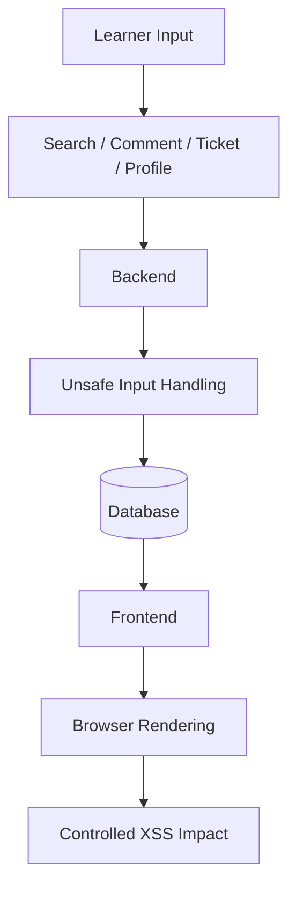

Potential scenarios:

```text
Reflected XSS
Stored XSS
DOM-based XSS
```

---

# 11. BOLA / IDOR Workflow

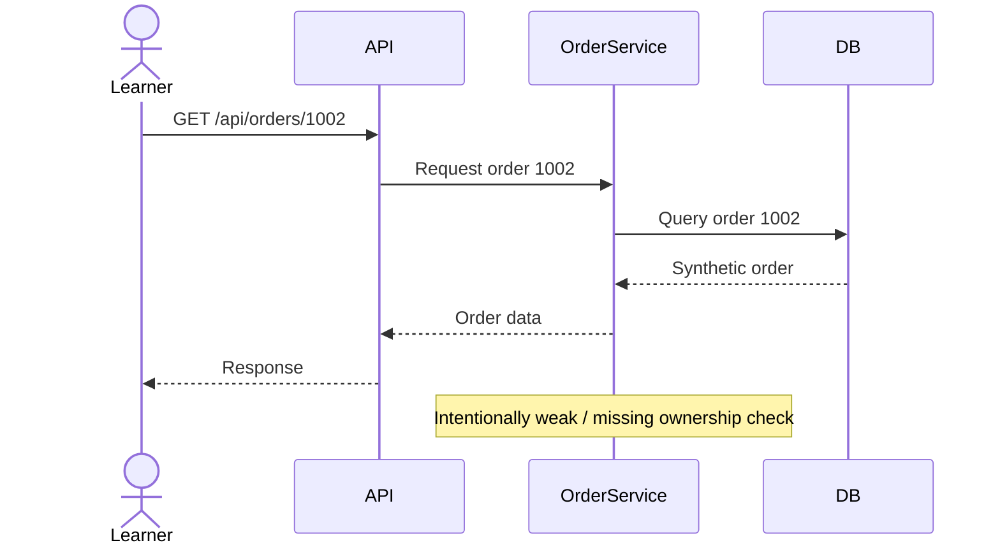

The training scenario can intentionally allow a user to access another synthetic user's resource by changing an identifier.

Example:

```text
GET /api/orders/1001
GET /api/orders/1002
GET /api/orders/1003
```

---

# 12. Authentication Attack Surface

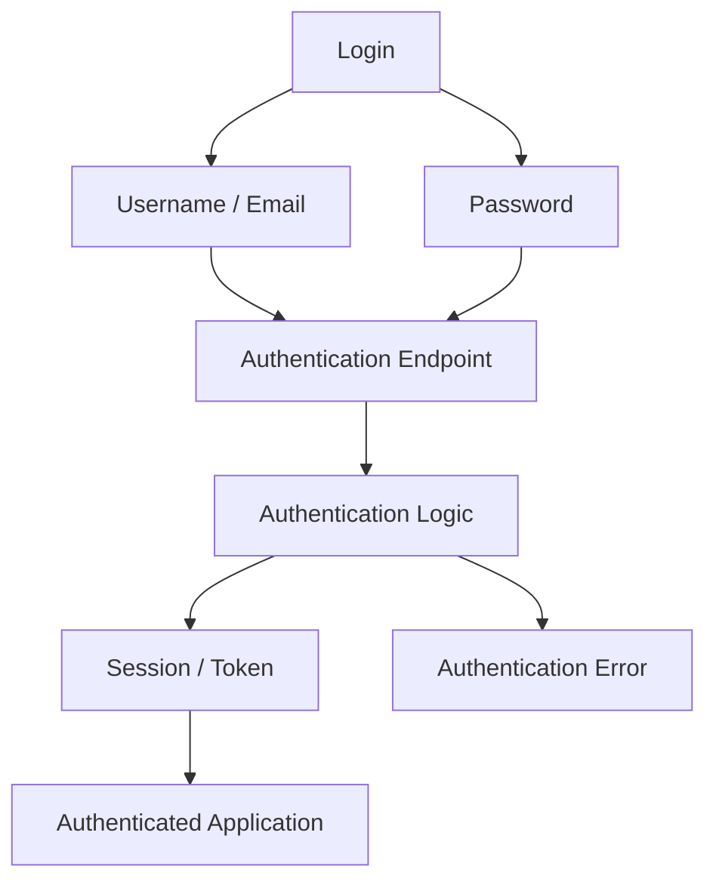

Possible intentionally weak scenarios:

```text
Weak password policy
Predictable behavior
Improper authentication handling
Weak session management
JWT implementation weaknesses
User enumeration
Missing rate limiting
```

These are implemented only as controlled lab scenarios.

---

# 13. CSRF Workflow

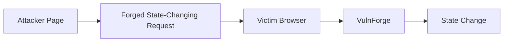

Example training flow:

```text
Victim Login
    ↓
Authenticated Session
    ↓
Malicious / Forged Request
    ↓
State-Changing Endpoint
    ↓
Action Executed
```

---

# 14. SSRF Workflow

SSRF is restricted to controlled lab infrastructure.

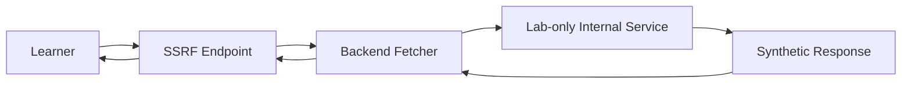

The lab must not provide access to:

```text
Public Internet
Cloud Metadata Services
Host Filesystem
Production Infrastructure
Real Internal Networks
Real Credentials
```

---

# 15. File Upload Attack Surface

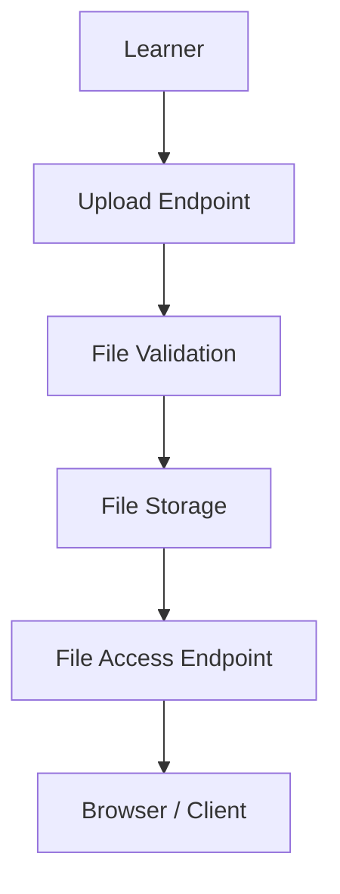

The intentionally weak lab can explore:

```text
Extension validation weaknesses
MIME validation weaknesses
Content validation weaknesses
Path handling issues
Access control issues
Direct file access
```

Only synthetic files should be used.

---

# 16. Business Logic Attack Workflow

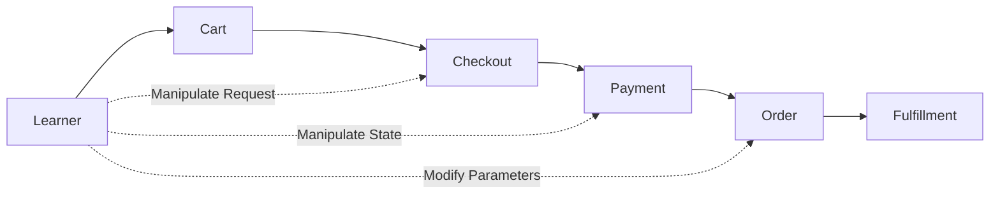

Potential lab scenarios:

```text
Quantity manipulation
Price manipulation
Coupon abuse
Payment state manipulation
Order state manipulation
Negative values
Workflow skipping
Race-condition style scenarios
```

---

# 17. Hidden Admin / Recon Workflow

The admin area should not be visible in normal navigation.

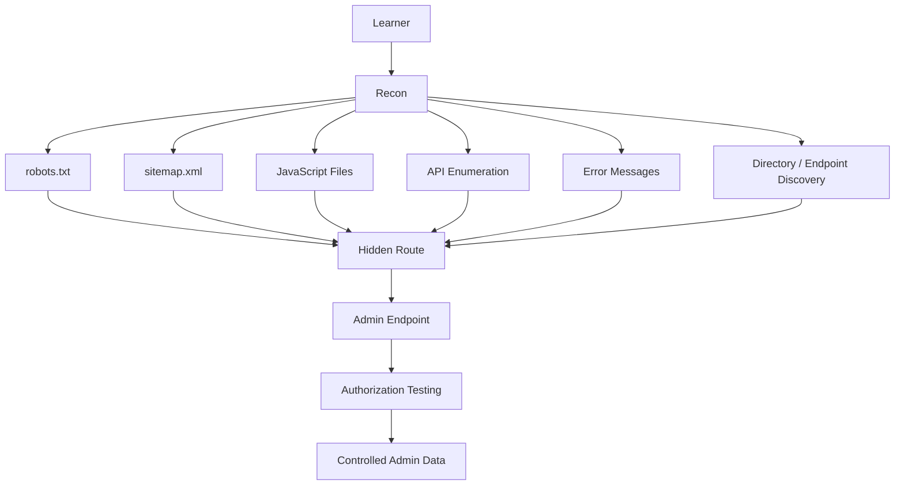

The hidden URL is **not** intended to be the actual security boundary. It is part of the reconnaissance challenge.

---

# 18. Attack Chain Workflow

VulnForge should allow multiple vulnerabilities to be combined into realistic attack chains.

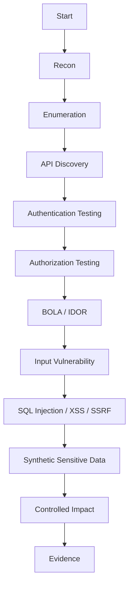

Example:

```text
Recon
  ↓
Find Hidden API
  ↓
Discover Order Endpoint
  ↓
BOLA
  ↓
Access Another Synthetic Order
  ↓
Find Vulnerable Parameter
  ↓
SQL Injection
  ↓
Read Synthetic Lab Data
```

---

# 19. Mission Workflow

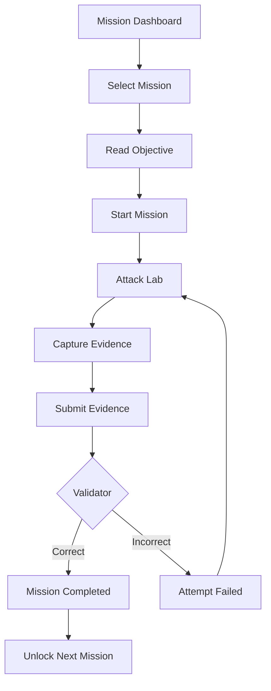

Mission states:

```text
LOCKED
   ↓
AVAILABLE
   ↓
IN_PROGRESS
   ↓
COMPLETED
```

---

# 20. Attack Mode

Attack Mode provides minimal assistance.

```text
Mission
   ↓
Target
   ↓
Objective
   ↓
Learner Recon
   ↓
Learner Exploitation
   ↓
Evidence
   ↓
Mission Validation
```

The learner is expected to use:

```text
Browser
Burp Suite
OWASP ZAP
curl
Nmap
ffuf
Other appropriate local testing tools
```

---

# 21. Guided Mode

Guided Mode adds progressively stronger hints.

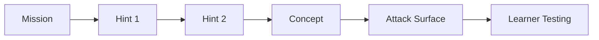

The goal is to teach the methodology rather than simply reveal the answer.

---

# 22. Defense Mode

After completing a vulnerability mission:

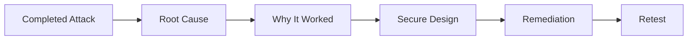

Defense Mode explains:

```text
What was vulnerable?
Why was it vulnerable?
What security control was missing?
How should it be fixed?
How do we retest it?
```

---

# 23. Lab Reset Workflow

```mermaid
flowchart TD
    RESET["RESET LAB"] --> TEMP["Clear Temporary Records"]
    TEMP --> USERS["Restore Synthetic Users"]
    USERS --> PRODUCTS["Restore Products"]
    PRODUCTS --> ORDERS["Restore Orders"]
    ORDERS --> SUPPORT["Restore Support Tickets"]
    SUPPORT --> FILES["Restore Synthetic Files"]
    FILES --> MISSIONS["Reset Mission Attempts"]
    MISSIONS --> SETTINGS["Restore Lab Settings"]
    SETTINGS --> HEALTH["Health Check"]

    HEALTH --> CHECK{"Clean Lab?"}

    CHECK -->|Yes| READY["LAB READY"]
    CHECK -->|No| ERROR["Reset Error"]
```

A reset should restore the application to a known starting state.

---

# 24. Database Architecture

```mermaid
erDiagram
    PROFILES ||--o{ ORDERS : places
    ORDERS ||--|{ ORDER_ITEMS : contains
    PRODUCTS ||--o{ ORDER_ITEMS : referenced_by
    PROFILES ||--o{ SUPPORT_TICKETS : creates
    PROFILES ||--o{ MISSION_ATTEMPTS : performs
    MISSIONS ||--o{ MISSION_ATTEMPTS : has

    PROFILES {
        uuid id PK
        string email
        string role
        timestamp created_at
    }

    PRODUCTS {
        uuid id PK
        string name
        decimal price
        integer stock
    }

    ORDERS {
        uuid id PK
        uuid user_id FK
        string status
        decimal total
        timestamp created_at
    }

    ORDER_ITEMS {
        uuid id PK
        uuid order_id FK
        uuid product_id FK
        integer quantity
        decimal price
    }

    SUPPORT_TICKETS {
        uuid id PK
        uuid user_id FK
        string subject
        text message
        string status
    }

    MISSIONS {
        uuid id PK
        string title
        string category
        string difficulty
        string objective
        string status
    }

    MISSION_ATTEMPTS {
        uuid id PK
        uuid mission_id FK
        uuid user_id FK
        string status
        text evidence
    }
```

---

# 25. Roles

The application can simulate multiple users and privilege levels.

```text
Guest
  │
  ▼
User
  │
  ├── Own Profile
  ├── Own Orders
  └── Own Tickets

Support
  │
  ├── Support Tickets
  └── Limited User Data

Admin
  │
  ├── Users
  ├── Orders
  ├── Tickets
  └── Lab Management
```

The vulnerability labs can intentionally contain broken authorization between these roles.

---

# 26. Trust Boundaries

```mermaid
flowchart LR
    ATTACKER["Learner / Attacker"]

    ATTACKER -->|Untrusted HTTP| FRONTEND["Frontend"]
    FRONTEND -->|Untrusted HTTP / JSON| BACKEND["Backend"]

    BACKEND -->|Application Data| DB["Database"]
    BACKEND -->|Files| STORAGE["Storage"]

    ATTACKER -.->|Tampered Requests| BACKEND
    ATTACKER -.->|Modified Parameters| BACKEND
    ATTACKER -.->|Modified JSON| BACKEND
    ATTACKER -.->|Direct API Requests| BACKEND
```

The most important principle:

> **Everything coming from the learner must be considered attacker-controlled.**

---

# 27. Complete VulnForge Workflow

This is the complete way the website is intended to be used.

```mermaid
flowchart TD
    START["Start VulnForge"] --> REGISTER["Register / Login"]

    REGISTER --> DASH["Dashboard"]

    DASH --> MISSIONS["Mission List"]
    MISSIONS --> TARGET["Select Target"]

    TARGET --> RECON["Recon"]
    RECON --> ENUM["Enumeration"]
    ENUM --> ATTACK["Attack Surface"]

    ATTACK --> BURP["Intercept Request"]
    BURP --> MODIFY["Modify Request"]
    MODIFY --> SEND["Send Request"]

    SEND --> SERVER["VulnForge Backend"]
    SERVER --> ROUTE["API Route"]
    ROUTE --> VULN["Vulnerable Logic"]
    VULN --> DATA["Database / Storage"]

    DATA --> RESPONSE["HTTP Response"]
    RESPONSE --> ATTACK

    ATTACK --> IMPACT["Controlled Impact"]
    IMPACT --> EVIDENCE["Capture Evidence"]

    EVIDENCE --> VALIDATE["Submit Mission"]
    VALIDATE --> RESULT{"Passed?"}

    RESULT -->|No| ATTACK
    RESULT -->|Yes| COMPLETE["Mission Completed"]

    COMPLETE --> DEFENSE["Defense Mode"]
    DEFENSE --> ROOT["Understand Root Cause"]
    ROOT --> FIX["Study Secure Fix"]
    FIX --> RETEST["Retest"]
    RETEST --> RESET["Reset Lab"]

    RESET --> NEXT["Next Mission"]
    NEXT --> MISSIONS
```

---

# 28. End-to-End Example

A learner attacking the BOLA lab would follow roughly this workflow:

```text
1. Start VulnForge
        ↓
2. Login as synthetic user A
        ↓
3. Open "My Orders"
        ↓
4. Proxy traffic through Burp Suite
        ↓
5. Observe:
   GET /api/orders/1001
        ↓
6. Change:
   /api/orders/1001
   →
   /api/orders/1002
        ↓
7. Send request
        ↓
8. Application returns synthetic order B
        ↓
9. Identify BOLA / IDOR
        ↓
10. Capture request + response as evidence
        ↓
11. Submit mission
        ↓
12. Mission validator checks evidence
        ↓
13. Mission completed
        ↓
14. Open Defense Mode
        ↓
15. Understand missing ownership check
        ↓
16. Study secure authorization
        ↓
17. Retest
        ↓
18. Reset lab
```

This same pattern can be applied to SQLi, XSS, CSRF, SSRF, file upload, JWT, API security, and business-logic missions.

---

# 29. Docker Architecture

```mermaid
flowchart TB
    HOST["Local Machine / Private VM"]

    subgraph DOCKER["Docker Compose"]
        NETWORK["vulnforge-network"]

        FRONT["Frontend Container"]
        BACK["Backend Container"]
    end

    FRONT --> BACK
    BACK --> SUPA["Supabase"]
```

Recommended environment:

```text
Local Machine
     │
     ▼
Docker Compose
     │
     ├── Frontend
     └── Backend
             │
             ▼
          Supabase
```

The vulnerable application should remain on:

```text
localhost
Private VM
Isolated Docker Network
Private Development Environment
```

Do not expose the deliberately vulnerable application to the public internet.

---

# 30. Recommended Project Structure

```text
VulnForge/
│
├── README.md
├── PRD.md
├── AGENT.md
├── CODEX.md
├── .gitignore
├── docker-compose.yml
│
├── docs/
│   ├── architecture.md
│   ├── threat-model.md
│   ├── api.md
│   ├── missions.md
│   └── security.md
│
├── frontend/
│   ├── package.json
│   ├── vite.config.ts
│   ├── tsconfig.json
│   └── src/
│       ├── app/
│       ├── components/
│       ├── pages/
│       ├── services/
│       ├── hooks/
│       ├── types/
│       └── utils/
│
├── backend/
│   ├── package.json
│   ├── tsconfig.json
│   ├── src/
│   │   ├── server.ts
│   │   ├── app.ts
│   │   ├── config/
│   │   ├── routes/
│   │   ├── controllers/
│   │   ├── services/
│   │   ├── modules/
│   │   ├── database/
│   │   └── utils/
│   └── tests/
│
├── supabase/
│   ├── migrations/
│   ├── seed.sql
│   └── README.md
│
└── scripts/
    ├── seed-lab
    ├── reset-lab
    └── health-check
```

---

# 31. Technology Stack

| Layer | Technology |
|---|---|
| Frontend | React + TypeScript |
| Build Tool | Vite |
| Styling | Tailwind CSS |
| Backend | Node.js + Express |
| Backend Language | TypeScript |
| Database | PostgreSQL |
| Backend Platform | Supabase |
| Authentication | Supabase Auth |
| File Storage | Supabase Storage |
| Containers | Docker / Docker Compose |
| Security Testing | Burp Suite, OWASP ZAP, Nmap, ffuf, curl |
| Version Control | Git + GitHub |

---

# 32. VulnForge Security Boundary

VulnForge deliberately has a weak application security model, but the **lab itself must remain isolated**.

```text
                ┌──────────────────────────┐
                │     SECURITY BOUNDARY    │
                │                          │
                │      VulnForge Lab       │
                │                          │
                │  Intentional Weaknesses  │
                │           ↓              │
                │    Synthetic Data Only   │
                │           ↓              │
                │    Local / Private Lab   │
                └──────────────────────────┘
```

The application can be insecure by design.

The **environment containing the application must not be unnecessarily exposed**.

---

# 33. Design Goal

VulnForge is not intended to be another collection of isolated vulnerable URLs.

The goal is to create a realistic application where the learner can move through:

```text
Recon
   ↓
Enumeration
   ↓
Attack Surface Mapping
   ↓
Request Interception
   ↓
Request Manipulation
   ↓
Vulnerability Discovery
   ↓
Exploitation
   ↓
Controlled Impact
   ↓
Evidence Collection
   ↓
Mission Completion
   ↓
Defense / Remediation
   ↓
Retesting
   ↓
Lab Reset
```

The final experience should feel like testing a real web application, while every vulnerable component remains deliberately designed, synthetic, and isolated for cybersecurity education.
