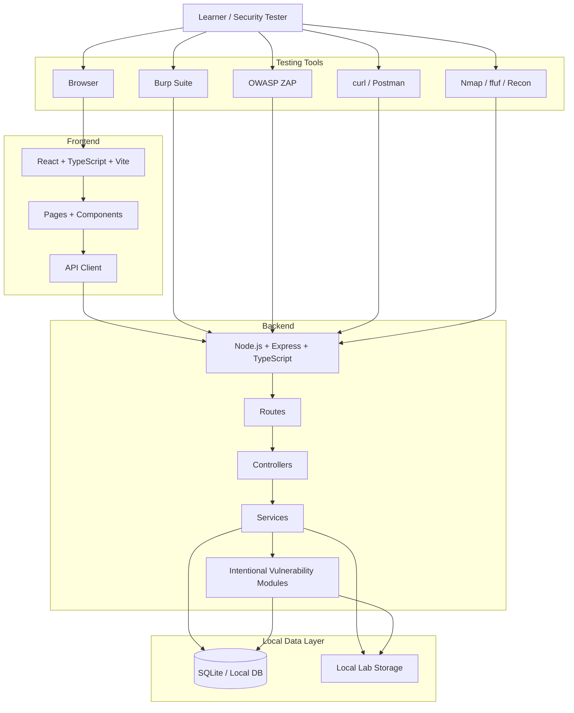
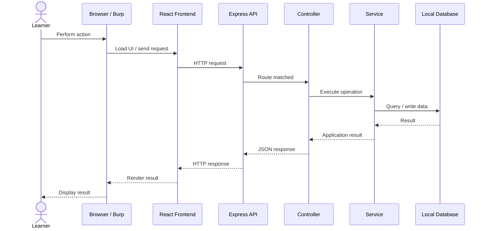
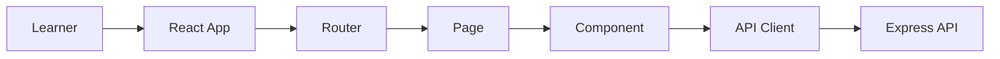
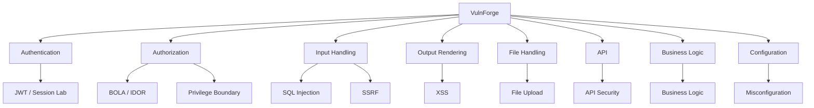
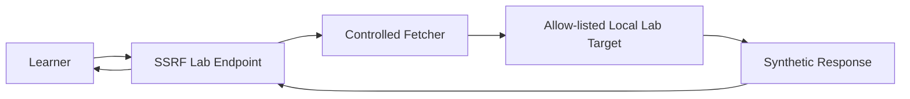
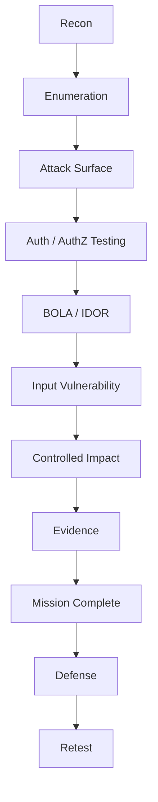
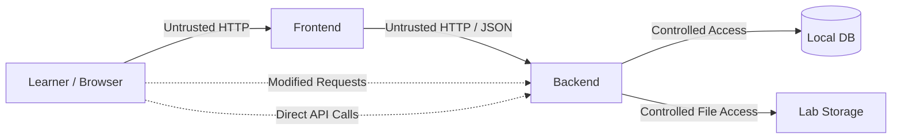
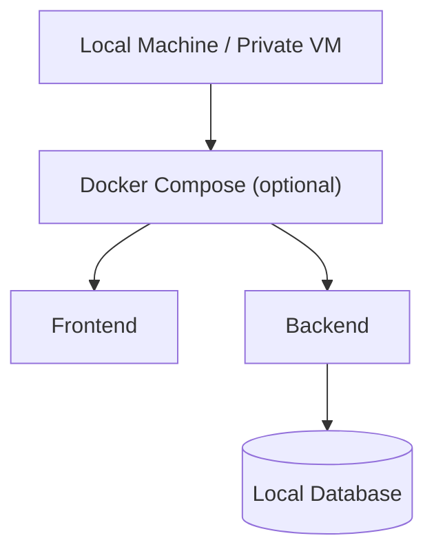

# VulnForge Architecture

## 1. System Overview



---

## 2. Real Request Flow



When using Burp Suite:

```text
Browser
   │
   ▼
Burp Suite
   │  modified HTTP request
   ▼
VulnForge API
   │
   ▼
Vulnerable Module
   │
   ▼
Local Database
```

---

## 3. Backend Request Pipeline

```mermaid
flowchart TD
    HTTP["HTTP Request"] --> ROUTE["Express Route"]
    ROUTE --> MW["Middleware"]
    MW --> CTRL["Controller"]
    CTRL --> SERVICE["Service"]
    SERVICE --> LAB{ "Lab / Core Logic" }
    LAB --> DATA[("Database")]
    DATA --> RESULT["Result"]
    RESULT --> SERVICE
    SERVICE --> CTRL
    CTRL --> RESP["HTTP Response"]
```

Middleware can provide basic request parsing, authentication/session lookup, request IDs, logging, and error handling. For lab endpoints, missing security controls are deliberate and documented rather than accidental.

---

## 4. Frontend Flow



The frontend is **not** a security boundary.

A learner can alter:

- request method
- URL
- query parameters
- headers
- cookies/tokens
- JSON body
- hidden UI state

---

## 5. Core Application Flow

```text
Register / Login
       ↓
Dashboard
       ↓
Products
       ↓
Cart / Checkout
       ↓
Orders
       ↓
Support
       ↓
Missions
```

The surrounding application provides realistic context for the vulnerable labs.

---

## 6. Vulnerability Surface



---

## 7. BOLA Workflow

```text
Authenticated User A
        ↓
GET /api/lab/orders/1001
        ↓
Observe object identifier
        ↓
Change identifier
        ↓
GET /api/lab/orders/1002
        ↓
Controlled cross-user object access
        ↓
Evidence
        ↓
Mission validation
```

---

## 8. SQL Injection Workflow

```text
Learner Input
      ↓
Lab Search Endpoint
      ↓
Intentionally Unsafe Query Handling
      ↓
Local PostgreSQL/SQLite data
      ↓
Controlled Result
      ↓
Evidence
```

The vulnerable behavior should remain isolated to the SQLi lab.

---

## 9. XSS Workflow

```text
Learner Input
      ↓
Search / Ticket / Comment
      ↓
Stored or Reflected Lab Data
      ↓
Frontend Rendering
      ↓
Controlled Browser-Side Impact
```

---

## 10. SSRF Workflow



Never allow the lab fetcher to reach arbitrary public hosts, cloud metadata, host files, production systems, or unrelated private networks.

---

## 11. Attack Chain



---

## 12. Mission Flow

```mermaid
flowchart TD
    L["Mission List"] --> S["Select Mission"]
    S --> ST["Start"]
    ST --> ATT["Attack Lab"]
    ATT --> EV["Submit Evidence"]
    EV --> V{ "Validator" }
    V -->|Pass| C["Completed"]
    V -->|Fail| F["Failed Attempt"]
    F --> ATT
    C --> DEF["Defense / Retest"]
```

---

## 13. Reset Flow

```text
RESET LAB
   ↓
Clear temporary lab records
   ↓
Restore synthetic users/data
   ↓
Restore vulnerable fixtures
   ↓
Reset mission attempts
   ↓
Clear temporary uploads
   ↓
Restore lab settings
   ↓
Health check
   ↓
READY
```

---

## 14. Trust Boundaries



Important boundaries:

1. Browser → backend
2. User → other user
3. User → support/admin
4. Lab → host
5. Lab → network

---

## 15. Deployment Model



Development may also run directly with Node.js and a local database without Docker.

---

## 16. Guiding Principle

> **Make the web application realistic, make the vulnerabilities deliberate, and keep the lab isolated.**
